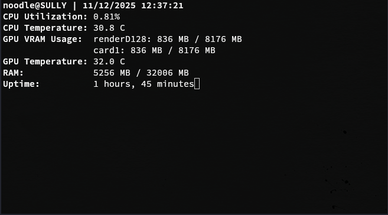

# Merrin (WIP)
A basic system monitor for Linux systems. Currently supports AMD CPUs and GPUs only.

## Demo


## Metrics
* CPU Utilization %
* CPU Temperature
* GPU Utilization
* GPU Temp
* RAM Utilization
* Uptime

## Installation
Run the installation script
```
./install.sh
```

## Usage
```
merrin
```

## License
GNU General Public License V2

Copyright (c) 2025 Jacob Niemeir
